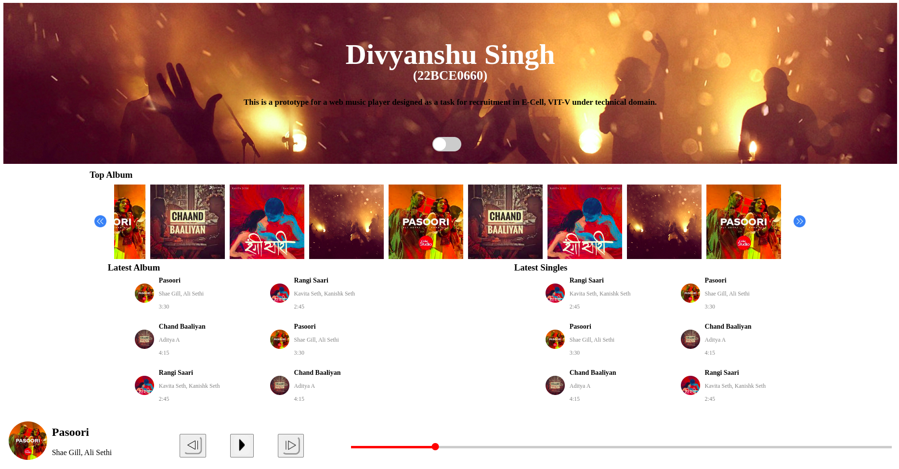
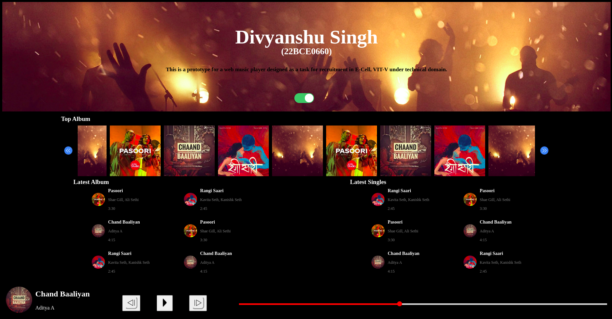

<h1>Web Music Player</h1>

- <b>This is just the client-side implementation. It doesn't have any functionality.
- Made using only HTML, CSS and JavaScript.
- It has light and dark mode. Use the toggle button to use the feature.</b>

<h3>Snapshots:</h3>

